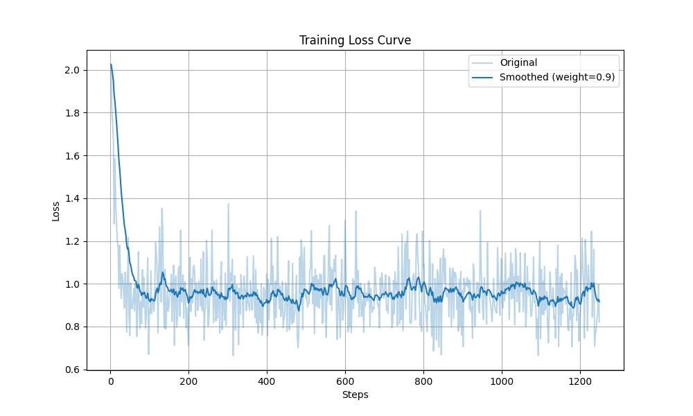

### Relation Extraction on DuIE 2.0 Dataset using BOFT

#### Introduction
In this project, we explore Parameter-efficient Finetuning (PEFT) using Orthogonal Butterfly (BOFT) for the mini project. We selected **Qwen2.5-1.5B-Instruct** as our foundational model. The downstream task focuses on **Relation Extraction (RE)**.

#### Directory Structure
```text
mini-project_RE/
├── data/
│   ├── train.json
│   ├── dev.json
├── eval/
│   ├── eval_oft_results.jsonl
│   ├── Mar19_00-56-08_autodl-container-b8beh6vsmb-13665e17.csv
├── src/
│   ├── utils.py
│   ├── configs.py
│   ├── duie_dataset.py
├── train_oft.py
├── eval_oft.py
├── requirements.txt
├── README.md
```

#### Conda environment for mini-project_RE
```bash
conda create -n mini-project_RE python=3.10
conda activate mini-project_RE
pip install -r requirements.txt
```

If there is a SSL error, use following code:
```bash
unset SSL_CERT_FILE
```

#### Run the experiments
Train the model:
```bash
python train_oft.py
```

Validate the model:
```bash
python eval_oft.py
```

#### Analyse the data
You can show the training curves with tensorboard:
```bash
tensorboard --logdir qwen-oft-relation-extraction/runs
```

Or, you can run the following codes to draw the plot from the loss data in `eval/Mar19_00-56-08_autodl-container-b8beh6vsmb-13665e17.csv`:
```python
import src.utils

plot_tran_loss_curve("eval/Mar19_00-56-08_autodl-container-b8beh6vsmb-13665e17.csv")
```
The loss curve will be:


We also provide an evaluation results in `eval/eval_oft_results.json`, you can copy it to root directory `.` and run the evaluation to show the metrics.
```bash
cp eval/eval_oft_results.jsonl .
python eval_oft.py
```
The results will be:
```text
Evaluation Results:
Average Metrics (Exact Matching) - Base Model: Precision=0.0143, Recall=0.0292, F1=0.0168
Average Metrics (Exact Matching) - Finetuned Model: Precision=0.5977, Recall=0.5178, F1=0.5378
Average Metrics (Soft Matching) - Base Model: Precision=0.0578, Recall=0.0917, F1=0.0635
Average Metrics (Soft Matching) - Finetuned Model: Precision=0.7700, Recall=0.6735, F1=0.6953
Average Metrics (Semantic Matching) - Base Model: Precision=0.1566, Recall=0.2476, F1=0.1746
Average Metrics (Semantic Matching) - Finetuned Model: Precision=0.8825, Recall=0.7710, F1=0.7947
```


